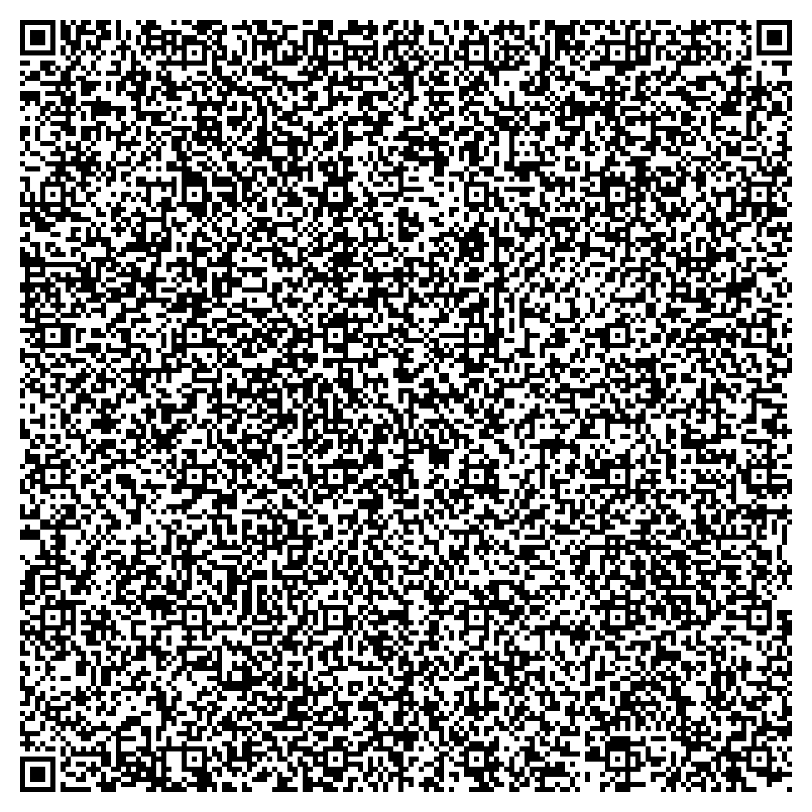
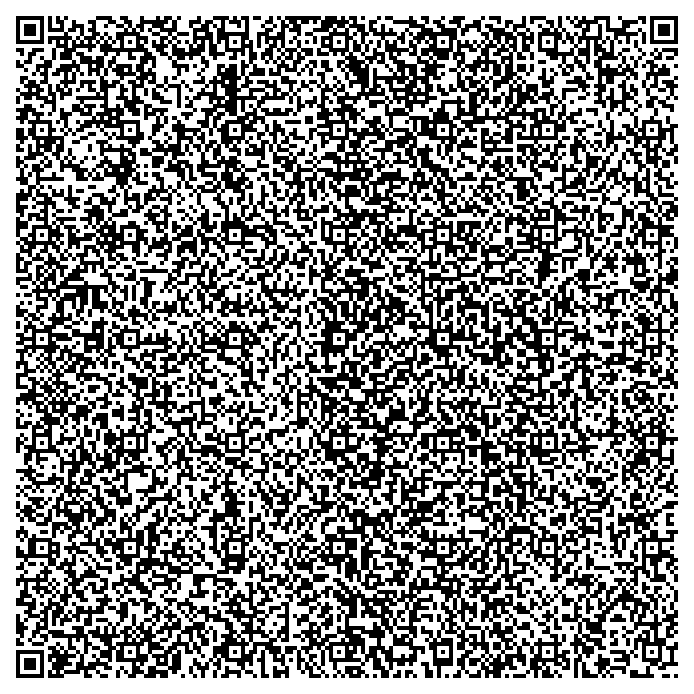
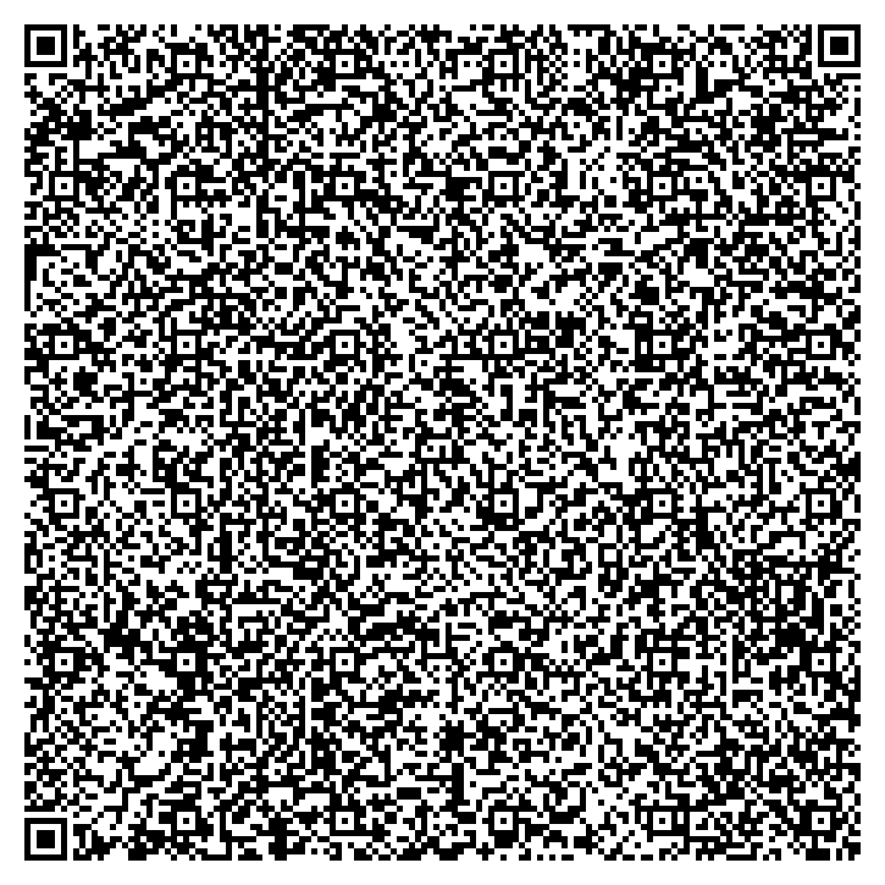
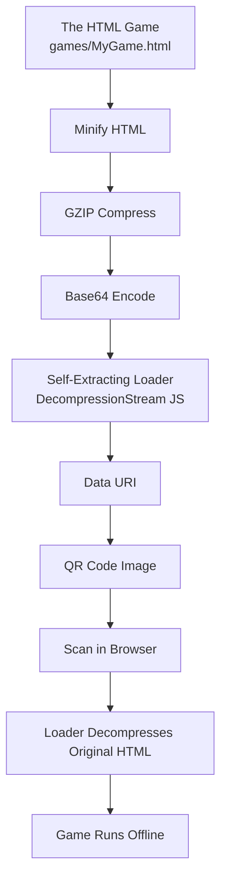
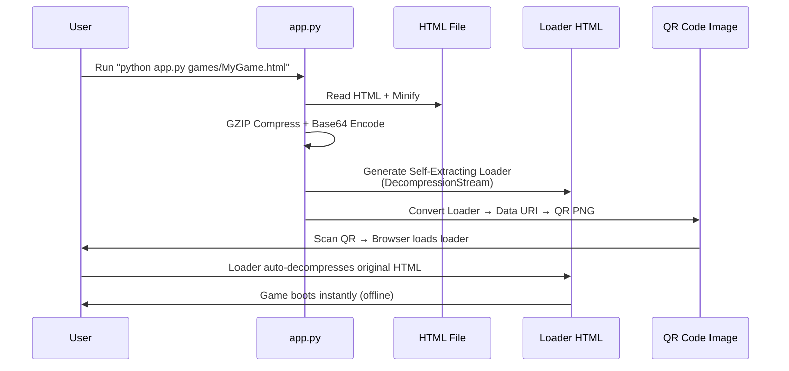
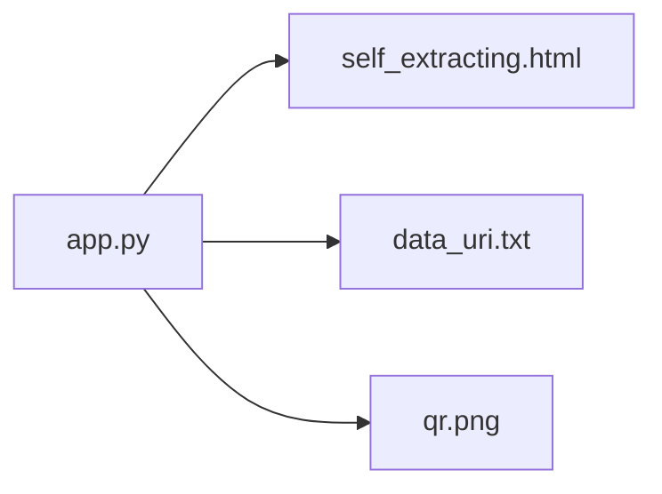

# 🎮 **QRcade**

### **Scan, play, and inspect tiny web games.**

QRcade transforms lightweight HTML games into **QR-bootable offline web apps**.
Drop any `.html` file into `/games`, run the converter, and instantly get:

* A **GZIP-compressed self-extracting loader**
* A **Base64 data URI**
* A **scan-to-play QR code**

No servers.
No hosting.
Just scan → play.

---

## 🚀 Features

* **Offline-ready** — games run entirely inside the browser
* **Tiny loader** — uses native `DecompressionStream` in a ~230-byte script
* **QR-friendly** — warns when payload exceeds QR capacity
* **CLI tool** — convert any HTML via `app.py`
* **Simple structure** — just `/app.py`, `/games`, `/outputs`
* **Game-agnostic** — works with any HTML file (games, demos, apps)

---

## 📁 Project Structure

```text
QRcade/
│
├── app.py                       # Main converter script
├── requirements.txt             # Dependencies
│
├── games/                       # HTML games
│   ├── FlappyBird.html
│   ├── SnakeGame.html
│   └── TicTacToe.html
│
└── outputs/                     # Auto-generated output folders
    ├── FlappyBird/
    ├── SnakeGame/
    └── TicTacToe/
```

---

## 📥 Installation

### 📦 **Clone the repository**

```bash
git clone https://github.com/ArchitJ6/QRcade.git
cd QRcade
```

### 🔧 **Install dependencies**

QRcade uses Python for compression, encoding, and QR image generation.
Install everything from `requirements.txt`:

```bash
pip install -r requirements.txt
```

---

## 🕹 Example Games (with QR Codes)

> ⚠️ After running `app.py`, each game will have its own `qr.png` here:
> `outputs/<GameName>/qr.png`. Update paths below if needed.

### 🐦 **FlappyBird**

A simple, smooth, circle-bird flappy clone optimized for QR.

**Scan to play:**


**🎥 Demo Video:**

<video src="assets/FlappyBird.mp4" controls style="max-width: 100%;"></video>

---

### 🐍 **SnakeGame**

A lightweight grid-based Snake game in pure HTML/JS.

**Scan to play:**


---

### ❌⭕ **TicTacToe**

Classic XO with alternating turns and restart.

**Scan to play:**


---

## 🧠 How It Works

QRcade compresses the HTML game into a tiny GZIP blob, embeds it in a
self-extracting JavaScript loader, and encodes that loader in a QR code.



---

## 🔧 QR Conversion Pipeline



---

## 🛠 Usage

### 1️⃣ Add the game

Place any HTML file inside the `games/` folder, for example:

```text
games/MyGame.html
```

### 2️⃣ Convert a game to QR

**Default** (uses `games/FlappyBird.html`):

```bash
python app.py
```

**Convert a specific game:**

```bash
python app.py games/SnakeGame.html
```

**Batch convert all games:**

```bash
for f in games/*.html; do python app.py "$f"; done
```

---

## 📦 Output Files

For each game (e.g., `games/FlappyBird.html`), QRcade generates:

```text
outputs/FlappyBird/
 ├── self_extracting.html   # Standalone loader HTML
 ├── data_uri.txt           # Base64 data URI used as QR payload
 └── qr.png                 # QR code image
```



---

## 📘 Supported Browsers

Requires browsers that support `DecompressionStream`, such as:

* Chrome 80+
* Edge 80+
* Opera 67+
* Most Android Chrome-based browsers

Safari support is partial/experimental, improving in newer versions.

---

## ⚠ QR Size Limit

Maximum payload for a single **Version-40 Low ECC QR** is about:

```text
≈ 2953 bytes
```

If the HTML + loader exceed this, `app.py` will print a warning.
The loader still works in a browser, but the QR may be too dense for some scanners.

---

## 🤝 Contributing

You can help by:

* Adding new micro-games to `games/`
* Improving minification or compression
* Experimenting with different loader strategies
* Building a QRcade “game menu” HTML that lists and links to all games

Pull requests and ideas are welcome.

---

## 📜 License

MIT License — free to use for personal, educational, and commercial projects.